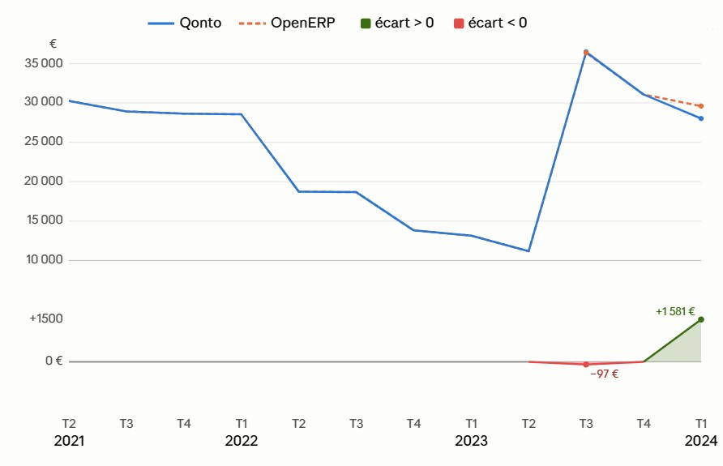

# Qonto MCP Hackathon Entry: Automated Invoice & Accounting Reconciliation

**Jean-Marc Le Peuvedic** | [Qonto x Anthropic MCP Hackathon](https://luma.com/497kgbv7)

## Overview

This project demonstrates a comprehensive **invoice lifecycle automation system** leveraging the **Qonto MCP connector** and Claude to solve real-world accounting challenges for small businesses in Europe.

The system orchestrates document retrieval, classification, storage, and financial reconciliation—transforming fragmented invoicing workflows into a unified, auditable process.

### Key Achievement

The project automatically **detects and visualizes discrepancies** between bank account balances (Qonto) and accounting records (OpenERP) at quarterly intervals, enabling rapid reconciliation and audit-ready reporting.



**Above:** Account balance tracking (EUR) across three years showing Qonto (blue) vs. OpenERP (dotted orange) with quarterly discrepancies (green/red, bottom). The system identified a €1,581 variance in Q4 2024 and a €97 variance in Q1 2024, both reconciled through automated invoice recovery.

---

## What It Does

### 1. **Missing Receipt Detection** (`qonto-justificatifs-manquants`)
Scans all Qonto transactions and produces a breakdown of missing receipts/invoices grouped by supplier. This skill:
- Queries Qonto for all non-zero transactions requiring attachments
- Filters by attachment status (required but missing)
- Groups by vendor for batch recovery workflows
- Feeds into downstream invoice recovery agents

### 2. **Invoice Recovery by Supplier** (`invoice-recovery`)
Given a list of missing invoices from a single vendor, retrieves them via:
- Local file system search (accounting folders)
- Vendor portals accessed via Claude in Chrome
- Email archives and follow-up drafts
- Returns the filepath of recovered invoices for next steps

### 3. **Vendor-Specific Automation** (`onshape-ptc-invoices`)
PTC/Onshape billing has unique constraints (annual subscription, no self-service portal, payment in USD). This skill:
- Knows the annual billing schedule (November)
- Retrieves invoices via email archives or vendor support
- Applies vendor-specific naming and currency handling
- Specializes the generic recovery flow for this high-volume vendor

### 4. **Invoice Filing & Naming** (`invoice-filing`)
Ensures every invoice follows a consistent, predictable naming convention:
- **Format:** `YYYYMMDD <Vendor>[-]<Invoice#>[ supplement].pdf`
- **Storage:** Organized by status (pending receipt → loaded in Qonto → processed)
- **Purpose:** Makes invoices findable by date and supplier; status visible at a glance
- **Scope:** Works for both received and issued invoices across both companies (CalCool Studios, Critical Optimisation)

### 5. **GitHub Invoice Automation** (`github-invoices`)
GitHub invoicing is trickier than most—different tax treatment (autoliquidation), USD billing, session-bound PDFs, and two documents per transaction (receipt + invoice). This skill:
- Identifies the correct legal entity via VAT number (not org name)
- Retrieves both receipt and invoice (required for audit)
- Handles currency conversion and VAT treatment
- Validates against Qonto transaction status

### 6. **Receipt Attachment to Qonto** (`stockage-justificatifs-qonto`)
Once a receipt is obtained and filed locally, this skill:
- Uploads it to Qonto via their S3 bucket (request presigned URL, upload file, confirm)
- Avoids duplicate attachments on the same transaction
- Reports success/skip/error per transaction
- Never moves money—only attaches documents (MCP limitation by design)

### 7. **Quarterly Account Reconciliation** (`openerp-soldes-fin-trimestre`)
Reconstructs the GL (general ledger) for a given account (e.g., bank account 512102) from OpenERP, computing quarter-end balances:
- Fetches fiscal years, periods (quarterly), and all postings for the account
- Cumulates debit/credit across all journals (bank journal + miscellaneous)
- Outputs balances at each quarter boundary for comparison to Qonto
- Detects the "écart" (difference) that triggers recovery workflows

---

## Video Demonstrations

### Video 1: Data Extraction & Table Comparison
**File:** `Comparaison soldes 2026-07-13 081113.mp4`

Demonstrates the **end-to-end extraction workflow**:
1. Query Qonto for account balances (quarterly snapshots)
2. Query OpenERP for GL reconstruction (same account, same periods)
3. Side-by-side comparison of rows (dates, amounts, discrepancies)
4. Identification of which transactions cause the difference

**Why it matters:** Reconciliation is data-driven, not manual. The video shows how Claude + MCP extracts authoritative data from both systems in one session.

### Video 2: Graphical Output Rendering
**File:** `Comparaison graphique 2026-07-13 083247.mp4`

Demonstrates **visualization of the reconciliation results** over time:
1. Multi-year chart (2021–2024) showing Qonto balance (blue) and OpenERP GL (orange) in parallel
2. Overlay of quarterly discrepancies (green when Qonto > OpenERP, red otherwise)
3. Interactive navigation to identify which quarters need invoice recovery
4. Export to PDF/image for audit reports

**Why it matters:** Finance teams think in charts, not tables. Visual reconciliation accelerates exception spotting and communicates confidence to auditors.

---

## Technical Stack

### MCP Connectors
- **Qonto MCP** – Direct API access to bank transactions, attachments, and account metadata
- **OpenERP MCP** – Query and extract GL data, fiscal years, periods

### Supporting Components
- **OpenERP MCP Server** (`OpenERP-mcp/`) – Local MCP bridge to Odoo/OpenERP instance
  - Source code: `openerp-mcp-server/openerp_mcp/`
  - Pre-built bundle: `mcpb-bundle/` (ready to deploy)
  - Third-party: `odoo-client-lib/` (Odoo RPC library)

### Skill Architecture
Each `.skill` file is a Claude action—a structured prompt + tool definitions that orchestrate multi-step workflows. They compose into a larger system:

```
qonto-justificatifs-manquants (scan) 
  ↓ [by supplier] 
invoice-recovery (retrieve) | onshape-ptc-invoices (PTC-specific)
  ↓ [filed + renamed]
invoice-filing (organize)
  ↓ [attach to Qonto]
stockage-justificatifs-qonto (upload)

openerp-soldes-fin-trimestre (reconcile)
  ↓ [compare to Qonto]
Identify discrepancies → Feed back to recovery loop
```

---

## Hackathon Relevance

**Why Qonto MCP?**
- **Core Problem:** European SMEs juggle multiple systems (bank, accounting, CRM, invoicing). Reconciliation is manual, slow, and error-prone.
- **Qonto MCP Solution:** Direct, authenticated access to transactional truth and attachment metadata enables Claude to:
  - Detect missing receipts *programmatically* (not manual reviews)
  - Retrieve invoices *in bulk* from multiple vendors
  - Validate attachment status *in real time*
  - Report discrepancies *as data*, not emails

**Competitive Advantage:**
- Qonto is the #1 B2B banking solution for EU SMEs → access to their transaction stream is high-value.
- MCP eliminates polling, webhooks, OAuth friction—Claude sees live data immediately.
- Orchestration of Qonto + OpenERP enables audit-ready reconciliation in minutes, not days.

---

## Project Structure

```
c:\tools\skills\
├── README.md                            (this file)
├── Final_rendering.jpg                  (reconciliation chart)
├── Comparaison soldes 2026-07-13 081113.mp4       (data extraction demo)
├── Comparaison graphique 2026-07-13 083247.mp4    (visualization demo)
│
├── [Skills]
├── qonto-justificatifs-manquants.skill  (scan missing receipts)
├── invoice-recovery.skill               (retrieve by supplier)
├── onshape-ptc-invoices.skill           (PTC vendor automation)
├── invoice-filing.skill                 (name & organize)
├── github-invoices.skill                (GitHub-specific invoice logic)
├── stockage-justificatifs-qonto.skill   (attach to Qonto)
├── openerp-soldes-fin-trimestre.skill   (quarterly reconciliation)
│
└── OpenERP-mcp/                         (OpenERP MCP server)
    ├── mcpb-bundle/                     (pre-built MCP bundle, ready to run)
    │   ├── manifest.json
    │   ├── README.md
    │   └── src/openerp_mcp/             (source code)
    ├── openerp-mcp-server/              (development environment)
    │   ├── openerp_mcp/                 (source code)
    │   ├── requirements.txt              (Python dependencies)
    │   └── setup.py                      (build configuration)
    └── odoo-client-lib/                 (Odoo RPC client library)
```

---

## Getting Started

### Prerequisites
- Authenticated Qonto account (employee or admin access)
- OpenERP/Odoo instance with XML-RPC enabled
- Claude Code with MCP support

### Setup
1. **Deploy the OpenERP MCP server:**
   ```bash
   cd OpenERP-mcp/mcpb-bundle
   # Follow README.md in that directory
   ```

2. **Connect Qonto MCP** in Claude (via connector settings or CLI):
   ```
   claude mcp add qonto
   ```

3. **Invoke a skill** from Claude Code:
   - "Show me all missing invoices" → `qonto-justificatifs-manquants`
   - "Find all GitHub invoices from 2024" → `github-invoices`
   - "Reconcile Q3 2024 account 512102" → `openerp-soldes-fin-trimestre` + compare to Qonto

### Example Workflow
```bash
# 1. Detect what's missing
→ qonto-justificatifs-manquants (CalCool Studios)
← JSON: { "GitHub": [list], "OnShape": [list], "AWS": [list] }

# 2. Recover invoices per vendor
→ invoice-recovery (GitHub supplier, transactions list)
→ onshape-ptc-invoices (OnShape supplier, transactions list)
← Files: /path/to/20240615 GitHub-INV-12345.pdf, etc.

# 3. File them
→ invoice-filing (rename and organize by status)
← Confirmed: filed in Comptabilité/Factures reçues/Chargées Qonto/

# 4. Attach to Qonto
→ stockage-justificatifs-qonto (transaction_id, file_path)
← Uploaded: 5 / 5 success

# 5. Reconcile
→ openerp-soldes-fin-trimestre (company_id=4, account=512102, period=Q3 2024)
← OpenERP GL balance: €28,450
← Qonto balance: €28,543
← Discrepancy: €93 (investigate)
```

---

## Limitations & Design Notes

### By Design (Not a Bug)
- **MCP is read/write for documents only.** The OpenERP MCP server cannot post GL entries—only query them. Qonto MCP can attach documents but never initiates transfers (SCA/2FA is required for payments).
- **PDF URLs expire.** GitHub serves PDFs behind session cookies (15-min expiry). Claude in Chrome is required, not headless fetching.
- **Quarterly, not real-time.** OpenERP periods are quarterly; reconciliation happens at quarter-end, not daily.

### Out of Scope (Future Work)
- Auto-categorization of transactions (that's OpenERP's job, via skill-driven user interaction)
- Multi-currency trading P&L (bank fees, FX gains already handled; investment P&L is different)
- Invoice approval workflows (Qonto MCP cannot approve transfers; teams must do it via web UI)

---

## Files & Data Locations

- **Accounting Folder (Windows):** `C:\Users\[user]\CalCool Studios\Comptabilité\`
- **Qonto Credentials:** Claude connector (authorized via OAuth, no hardcoded keys)
- **OpenERP Credentials:** `.env` or config file in `OpenERP-mcp/openerp-mcp-server/`
- **Invoices:** Organized per `invoice-filing` convention; metadata in `invoice-filing/references/exemples-noms.md`

---

## Author & Attribution

**Jean-Marc Le Peuvedic** – Full workflow design, all skills, OpenERP MCP bridge, and system orchestration for Qonto x Anthropic Hackathon 2024.

**Technologies:**
- Claude (Anthropic)
- Qonto MCP Connector
- OpenERP MCP Server (custom build)
- Python, jq, Bash scripting

---

## Hackathon Links
- [Qonto x Anthropic MCP Hackathon](https://luma.com/497kgbv7)
- [Qonto](https://qonto.com)
- [Anthropic Claude](https://claude.ai)

